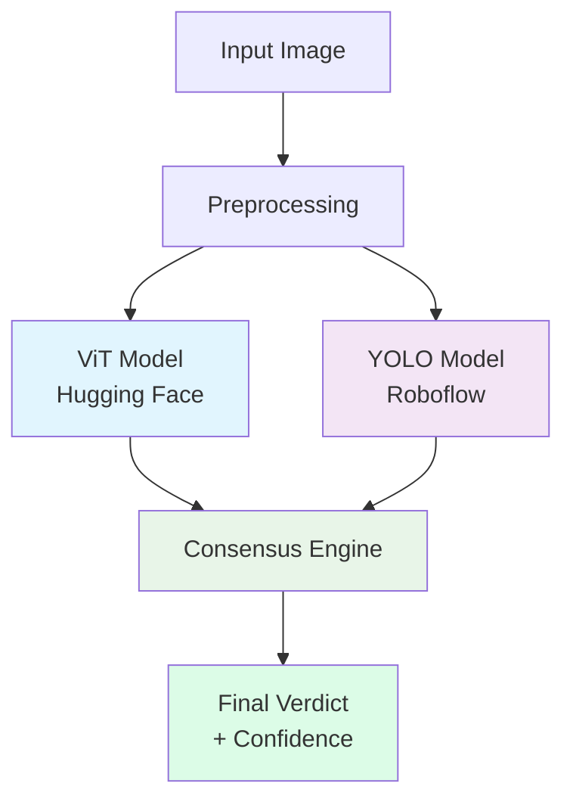
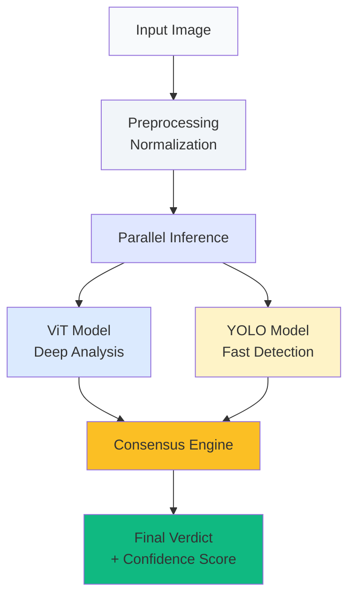
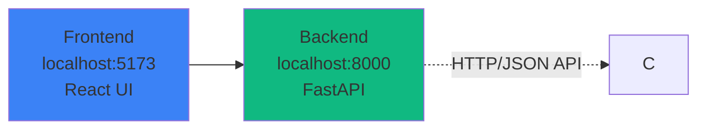

# Axon Architecture Documentation

## Overview

Axon is a sophisticated face anti-spoofing detection system that combines multiple AI models to provide robust protection against presentation attacks.

## System Architecture

### Dual-Model Design

**Diagram Explanation:**
This diagram illustrates the core dual-model architecture of Axon. The system processes an input image through two parallel AI models:

- **Preprocessing**: Normalizes and prepares the image for optimal model performance
- **ViT Model** (blue): Performs deep analysis using Vision Transformer for subtle pattern detection
- **YOLO Model** (purple): Provides fast object detection for obvious presentation attacks
- **Consensus Engine** (green): Intelligently fuses both model outputs using hierarchical decision logic
- **Final Verdict** (light green): Produces the definitive anti-spoofing result with confidence scoring

The parallel processing ensures both speed (YOLO) and accuracy (ViT) while the consensus engine provides robust decision-making.

### Model Components

#### 1. Vision Transformer (ViT)
- **Source**: Hugging Face
- **Purpose**: Deep facial analysis and texture detection
- **Strengths**: 
  - Advanced pattern recognition
  - Explainable AI via Grad-CAM
  - Detects subtle digital artifacts

#### 2. YOLO Detector
- **Source**: Roboflow Serverless API
- **Purpose**: Fast presentation attack detection
- **Strengths**:
  - Real-time processing
  - Excellent for obvious attacks
  - Lightweight and efficient

### Consensus Logic

The system uses hierarchical decision-making:

1. **YOLO as Primary Gatekeeper**:
   - No detection → INCONCLUSIVE
   - Detects spoof → SPOOF
   - Detects real → ViT consulted

2. **ViT as Deep Analyst**:
   - Confirms YOLO real detections
   - Applies 25% confidence penalty when disagreeing
   - Provides detailed reasoning via Grad-CAM

### Operating Modes

#### Single-Model Modes
- **ViT Only**: Deep analysis with explainability
- **YOLO Only**: Fast detection for edge cases
- **Use Cases**: Ablation studies, performance testing

#### Consensus Mode
- **Dual verification**: Both models collaborate
- **Intelligent fusion**: Weighted confidence scoring
- **Maximum accuracy**: Combines strengths of both approaches

## Data Flow

**Diagram Explanation:**
This flowchart shows the detailed data processing pipeline through the Axon system:

1. **Input Image** (white): Raw face image from user upload or camera capture
2. **Preprocessing** (light gray): Normalizes image format, size, and pixel values for model compatibility
3. **Parallel Inference** (light purple): Splits processing to both models simultaneously for efficiency
4. **ViT Model** (blue): Conducts deep texture analysis and detects subtle digital manipulation artifacts
5. **YOLO Model** (yellow): Performs rapid object detection for obvious presentation attacks
6. **Consensus Engine** (orange): Applies hierarchical logic to combine model outputs with confidence weighting
7. **Final Verdict** (green): Outputs definitive result (REAL/SPOOF/INCONCLUSIVE) with confidence percentage

The parallel architecture ensures optimal performance while the consensus engine provides robust decision-making by leveraging each model's strengths.

## Technical Stack

### Backend
- **Framework**: FastAPI
- **Language**: Python 3.9+
- **AI Models**: 
  - Hugging Face Transformers
  - Roboflow Inference SDK
- **XAI**: Grad-CAM for ViT explainability

### Frontend
- **Framework**: React 19 + Vite
- **Styling**: TailwindCSS
- **Animations**: Framer Motion
- **Icons**: Lucide React

## Security Features

### Attack Detection
- **Printed Photos**: High accuracy detection
- **Digital Screens**: Replay attack prevention
- **3D Masks**: Advanced texture analysis
- **Deepfakes**: Generative artifact detection

### Explainability
- **Grad-CAM Heatmaps**: Visual reasoning display
- **Confidence Scoring**: Transparent decision metrics
- **Model Contributions**: Clear attribution per mode

## Performance Considerations

### Latency
- **YOLO**: <100ms typical
- **ViT**: 200-500ms typical
- **Consensus**: 300-600ms total

### Accuracy
- **Individual Models**: 85-92% depending on attack type
- **Consensus Mode**: 94-98% fused accuracy
- **False Positive Rate**: <2% in optimal conditions

## Deployment Architecture

### Development

**Diagram Explanation:**
This diagram shows the development deployment architecture of the Axon system:

- **Frontend** (blue): React application running on port 5173, providing the user interface for image upload and results display
- **Backend** (green): FastAPI server on port 8000, handling AI model inference and business logic
- **HTTP/JSON API**: RESTful communication protocol between frontend and backend for image processing requests

The architecture supports:
- **Separate Development**: Frontend and backend can be developed and deployed independently
- **Scalable Design**: Backend can be scaled horizontally for increased throughput
- **Clean Separation**: Clear API boundaries enable easy testing and maintenance
- **Real-time Processing**: Direct communication ensures low latency for user interactions

In production, multiple backend instances can be deployed behind a load balancer while the frontend can be served from a CDN for optimal performance.

### Production Considerations
- **Load Balancing**: Multiple backend instances
- **Caching**: Model inference optimization
- **Monitoring**: Health check endpoints
- **Security**: API rate limiting and authentication

## Future Enhancements

### Model Improvements
- **Ensemble Methods**: Additional model types
- **Continuous Learning**: Adaptive threat detection
- **Edge Deployment**: On-device processing options

### Feature Expansion
- **Video Analysis**: Temporal spoofing detection
- **Multi-modal**: Voice + face verification
- **Liveness Challenges**: Active user interaction tests
