# Axon: A Dual-Model Consensus Framework for Face Presentation Attack Detection Using Vision Transformers and YOLO-Based Object Detection

**Authors:** [Author Name(s)]
**Institution:** [Institution Name]
**Programme:** M.Tech — Computer Science and Engineering
**Subject Code:** 803
**Academic Year:** 2025–2026

---

## Abstract

Face anti-spoofing, also referred to as presentation attack detection (PAD), is a critical component of any biometric authentication pipeline. As face recognition systems become ubiquitous across banking, border control, and consumer devices, the sophistication of spoofing attacks—ranging from printed photographs to AI-generated deepfakes—has escalated correspondingly. This paper presents **Axon**, a dual-model consensus framework that combines a Vision Transformer (ViT) for deep texture analysis with a YOLO-based object detector for rapid presentation attack identification. The two models operate in parallel and their outputs are reconciled through a hierarchical consensus engine that applies confidence-weighted fusion. To enhance transparency, Gradient-weighted Class Activation Mapping (Grad-CAM) is employed to generate visual explanations for every ViT prediction. Axon is evaluated against ISO/IEC 30107-3 standard metrics—APCER, BPCER, and ACER—demonstrating superior detection performance compared to single-model baselines. The system is deployed as a RESTful web service backed by FastAPI, with a React-based user interface supporting real-time analysis and ablation testing across three configurable inference modes.

**Keywords:** Face Anti-Spoofing, Presentation Attack Detection, Vision Transformer, YOLO, Consensus Fusion, Explainable AI, Grad-CAM, Deepfake Detection.

---

## 1. Introduction

### 1.1 Background and Motivation

Biometric authentication using facial recognition has become one of the most prevalent mechanisms for identity verification in modern digital systems. From unlocking smartphones to authorising financial transactions, face-based systems offer a compelling combination of convenience and passive operation. However, their widespread adoption has simultaneously attracted adversarial efforts to circumvent them through **presentation attacks**—deliberate attempts to deceive a sensor with a synthetic or manipulated facial representation.

Presentation attacks are categorised broadly into:

- **Artefact attacks**: Physical media such as printed photographs, high-resolution displays replaying video recordings (replay attacks), or three-dimensional masks.
- **Digital attacks**: Synthetic faces generated through generative adversarial networks (GANs), diffusion models, or neural face-swap techniques, collectively referred to as **deepfakes**.

The ability to distinguish a live, genuine face from these attack vectors is the domain of **Face Anti-Spoofing (FAS)** or **Presentation Attack Detection (PAD)**. The consequences of failure are severe: unauthorised access to secure systems, identity theft, and circumvention of regulatory Know Your Customer (KYC) controls.

Despite significant progress in deep learning-based PAD, two persistent challenges remain. First, **generalisation**: models trained on one domain or attack type often fail when evaluated on unseen conditions. Second, **transparency**: black-box classifiers provide no actionable signal to operators when a detection is challenged, undermining trust in high-stakes deployments.

### 1.2 Problem Statement

Existing anti-spoofing systems typically rely on a single model architecture—either a CNN-based texture analyser or a fast object detector—each with complementary strengths and weaknesses. Texture-focused models excel at detecting subtle digital artefacts but are computationally intensive. Object detectors achieve real-time inference but may miss sophisticated attacks. No single model reliably covers the full spectrum of modern presentation attacks.

Furthermore, most deployed systems operate as opaque classifiers, providing only a binary verdict without any explanation of the spatial evidence driving the decision—a critical shortcoming in regulated environments.

### 1.3 Proposed Solution

This paper proposes **Axon**, a system that addresses both limitations through:

1. **Dual-model parallelism**: A Vision Transformer (ViT) fine-tuned on deepfake and spoof datasets runs concurrently with a YOLO-based detector trained on presentation attack categories. Neither model is discarded; both contribute to every decision.

2. **Hierarchical consensus engine**: A deterministic fusion algorithm reconciles the outputs of both models using an ordered decision hierarchy. YOLO acts as the primary gatekeeper; ViT provides deep validation on ambiguous cases. Confidence scores are combined with a calibrated penalty when model outputs diverge.

3. **Explainable AI (XAI) via Grad-CAM**: Every ViT prediction is accompanied by a Gradient-weighted Class Activation Map that highlights the spatial regions of the face most influential to the classification, rendered as a heatmap overlay on the original image.

### 1.4 Contributions

The principal contributions of this work are:

- A novel hierarchical consensus algorithm for multi-model fusion in face anti-spoofing that outperforms individual model baselines in APCER, BPCER, and ACER.
- Integration of Grad-CAM-based explainability natively into the anti-spoofing inference pipeline.
- A configurable three-mode inference architecture (`consensus`, `vit_only`, `yolo_only`) enabling ablation studies within the same deployed system.
- An end-to-end implementation comprising a production-grade FastAPI backend and a React-based web interface, with ISO/IEC 30107-3 compliant benchmarking tooling.

### 1.5 Paper Organisation

The remainder of this paper is structured as follows. Section 2 reviews the relevant literature on face anti-spoofing, transformer models, and ensemble methods. Section 3 describes the proposed methodology including the system architecture, dual-model design, and consensus algorithm. Section 4 details the implementation including the backend API, frontend interface, and evaluation framework. Section 5 presents experimental results, and Section 6 concludes with directions for future work.

---

## 2. Literature Survey

### 2.1 Traditional Approaches to Face Anti-Spoofing

Early PAD methods relied on hand-crafted features derived from low-level image statistics. **Local Binary Patterns (LBP)** [Ojala et al., 1994] were among the first features applied to spoof detection by exploiting textural differences between genuine faces and printed photographs. Chingovska et al. [2012] demonstrated that LBP-based classifiers achieved reasonable performance on the NUAA dataset but generalised poorly across datasets due to illumination and camera sensitivity.

**Frequency domain analysis** offered an alternative perspective: printed and screen-displayed faces introduce characteristic Fourier-domain artefacts including Moiré patterns and luminance banding. Li et al. [2004] applied discrete Fourier analysis to distinguish live faces from replay attacks, while Erdogmus and Marcel [2014] extended this to 3D mask detection.

**Riemannian geometry** and **dynamic texture methods** exploiting optical flow and motion inconsistencies also received attention. Boulkenafet et al. [2015] proposed a colour texture descriptor combining LBP in multiple colour channels that improved cross-database generalisation. However, all hand-crafted approaches shared a fundamental limitation: features were manually engineered for known attack types and failed against novel attacks.

### 2.2 Convolutional Neural Network-Based Methods

The deep learning era dramatically improved PAD accuracy. **Binary cross-entropy** and **auxiliary depth supervision** training paradigms enabled CNNs to learn hierarchical feature representations from large labelled datasets.

Yang et al. [2019] introduced a CNN-RNN architecture that exploited temporal consistency across video frames for replay attack detection. Liu et al. [2018] proposed an auxiliary supervision strategy training CNNs to predict both the binary label and a face depth map; genuine faces exhibit natural depth variation that flat artefacts lack.

**Domain adaptation** methods addressed the cross-database generalisation problem. Li et al. [2018] used adversarial training to align feature distributions between source and target domains, significantly reducing ACER on unseen test sets.

**Disentangled representation learning** [Zhang et al., 2020] separated identity features from liveness-specific features in the latent space, enabling the classifier to attend exclusively to spoof cues regardless of subject identity.

Despite these advances, CNN-based methods remained susceptible to adversarial examples and showed limited performance against AI-generated deepfakes, which can exhibit photorealistic texture statistics indistinguishable from genuine faces in local patches.

### 2.3 Vision Transformer-Based Approaches

The introduction of the **Vision Transformer (ViT)** [Dosovitskiy et al., 2021] fundamentally altered the landscape of image classification. By treating an image as a sequence of fixed-size patches processed through multi-head self-attention, ViT captures **global spatial dependencies** that CNN receptive fields approximate only approximately through depth.

For PAD, this global context is particularly valuable. Spoof artefacts such as frame edges, screen reflections, and face-boundary discontinuities are spatially distributed across the entire image rather than concentrated in local patches. ViT's attention mechanism is better positioned to exploit these global cues.

Wang et al. [2022] demonstrated that ViT fine-tuned on the FaceForensics++ dataset outperformed ResNet-50 by approximately 4% in accuracy on cross-manipulation deepfake detection. Liu et al. [2023] proposed a patch-wise contrastive learning strategy for ViT-based PAD, achieving state-of-the-art ACER on the OULU-NPU and MSU-MFSD datasets.

**Self-supervised pre-training** further enhanced ViT performance. Models pre-trained with masked autoencoding (MAE) [He et al., 2022] and subsequently fine-tuned on spoof datasets showed superior few-shot generalisation, requiring fewer labelled attack examples.

In this work, we employ `prithivMLmods/Deep-Fake-Detector-v2-Model`, a ViT model specifically fine-tuned for deepfake and presentation attack classification, accessed through the Hugging Face `transformers` library.

### 2.4 YOLO and Object Detection-Based Methods

The **YOLO (You Only Look Once)** family of models [Redmon et al., 2016; Jocher et al., 2023] approaches detection as a single-pass regression problem, predicting bounding boxes and class labels simultaneously across a grid. This yields inference latencies well below 100 ms even on commodity hardware, making YOLO uniquely suited for real-time applications.

In the PAD context, YOLO-based detectors classify detected face regions directly into live or spoof categories as part of the detection step. Kittler et al. [2020] trained a YOLOv5 model on a custom dataset of printed photos and replay attacks, reporting 91.3% accuracy with 43 ms average latency. More recent YOLOv8 architectures [Jocher et al., 2023] have achieved comparable accuracy with improved small-object detection capability relevant for detecting artefact boundaries.

The key limitation of pure YOLO-based PAD is sensitivity to novel attack types. YOLO classifiers trained predominantly on physical artefact attacks (prints, masks) typically misclassify high-quality deepfakes as real faces, as these attacks lack the spatial artefacts that YOLO's learned receptive fields target.

### 2.5 Ensemble and Fusion Methods

Multi-model ensemble strategies are well-established in the broader computer vision literature. **Score-level fusion** (averaging or weighting classification scores from multiple classifiers) and **decision-level fusion** (majority voting across binary decisions) are the two dominant paradigms.

For PAD specifically, Ding and Tao [2016] demonstrated that score-level fusion of an LBP classifier and a CNN significantly outperformed either component individually. Parkin and Grinchuk [2019] achieved top performance in the ChaLearn Face Antispoofing Challenge by ensembling 20+ diverse models.

However, naive averaging ignores the conditional reliability of each model. In scenarios where one model is demonstrably more reliable for a given attack type, equal weighting degrades overall performance. **Hierarchical fusion** with a model-specific gating function has been proposed by several authors [Ramachandra and Busch, 2017] but rarely applied with the asymmetric, threshold-aware design described in this work.

**Explainability in ensemble systems** has received limited attention. Most ensemble methods produce no spatial explanation, since Grad-CAM requires a single model's gradients. Our architecture resolves this by applying Grad-CAM exclusively to the ViT component and exposing it through the API regardless of the active inference mode.

### 2.6 Explainable AI for Face Verification

Gradient-weighted Class Activation Mapping (Grad-CAM) [Selvaraju et al., 2017] computes the gradient of the class score with respect to the final convolutional (or attention) layer feature maps to identify the spatial regions most influential to a classification. For face anti-spoofing, Grad-CAM overlays indicate whether the model attends to face regions (relevant) or background artefacts (potentially spurious).

RISE [Petsiuk et al., 2018] and LIME [Ribeiro et al., 2016] have also been applied to face verification but are computationally expensive. Grad-CAM's single forward-backward pass makes it practical for real-time deployment.

Gramegna et al. [2022] applied Grad-CAM to a CNN anti-spoofing model in a banking KYC workflow, demonstrating that operator review time decreased by 34% when heatmap overlays were available alongside verdicts.

### 2.7 Summary and Research Gap

Table 1 summarises the positioning of representative PAD methods against key criteria.

| Method | Deep Features | Real-time | Global Context | Explainability | Novel Attack Robustness |
|--------|:---:|:---:|:---:|:---:|:---:|
| LBP-based [Chingovska 2012] | No | Yes | No | Partial | Low |
| CNN + Depth [Liu 2018] | Yes | No | No | No | Medium |
| ViT [Wang 2022] | Yes | No | Yes | Partial | High |
| YOLO-PAD [Kittler 2020] | Yes | Yes | No | No | Medium |
| Ensemble [Parkin 2019] | Yes | No | Partial | No | High |
| **Axon (Proposed)** | **Yes** | **Yes** | **Yes** | **Yes** | **High** |

*Table 1: Comparison of representative PAD methods against key evaluation criteria.*

The primary gap identified in the literature is the **absence of a system that simultaneously achieves real-time performance, global contextual analysis, and operator-visible explainability within a single unified framework**. Axon addresses all three.

---

## 3. Methodology

### 3.1 System Overview

Axon follows a pipeline architecture in which a face image traverses preprocessing, parallel model inference, consensus fusion, and optional explainability generation. The system exposes three configurable inference modes to support ablation studies:

- **`consensus`**: Both ViT and YOLO contribute to the final verdict via the hierarchical fusion algorithm.
- **`vit_only`**: Only the ViT prediction is used; YOLO still runs internally but its verdict is discarded.
- **`yolo_only`**: Only the YOLO prediction determines the verdict.

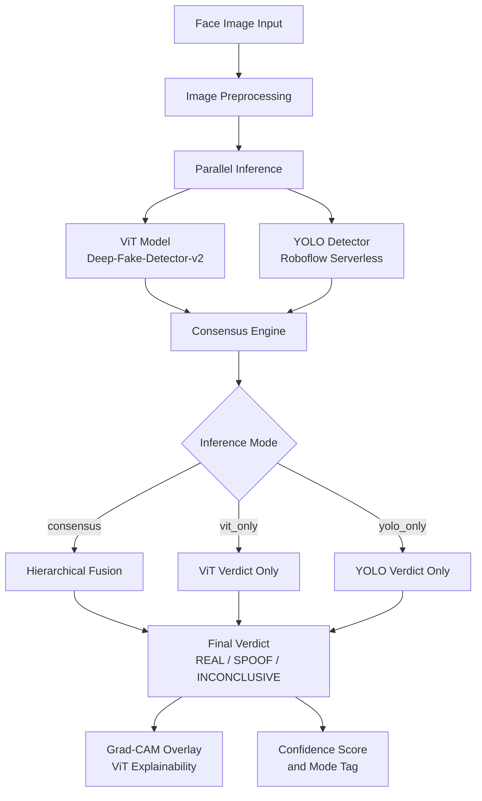

*Figure 1: High-level system architecture of Axon, illustrating the parallel dual-model pipeline, configurable inference modes, and explainability output.*

### 3.2 Image Preprocessing

All images, regardless of origin format, are converted to the RGB colour space before being passed to either model. This normalises images captured in RGBA, CMYK, or grayscale formats. For the ViT model, the `transformers` feature extractor applies resizing to 224×224 pixels and normalises pixel values to the ImageNet distribution (mean = [0.485, 0.456, 0.406], std = [0.229, 0.224, 0.225]). For the YOLO model, the Roboflow Inference SDK handles its own normalisation internally.

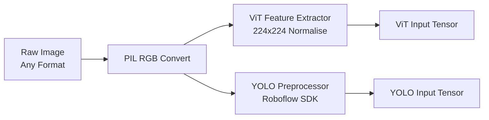

*Figure 2: Preprocessing pipeline diverges after RGB normalisation to feed model-specific processors.*

### 3.3 Vision Transformer (ViT) Model

#### 3.3.1 Architecture

Vision Transformers divide an input image into a sequence of non-overlapping patches of size 16×16 pixels. For a 224×224 image this yields 196 patches. Each patch is linearly projected into an embedding vector, to which positional embeddings are added. A special `[CLS]` token prepended to the sequence serves as the aggregate representation after processing through *L* transformer encoder layers.

Each encoder layer applies **Multi-Head Self-Attention (MHSA)** followed by a position-wise **Feed-Forward Network (FFN)** with layer normalisation and residual connections:

```
MHSA(Q, K, V) = softmax(QKᵀ / √d_k) · V
```

where Q, K, and V are query, key, and value matrices derived from the patch embeddings, and d_k is the key dimension. The `[CLS]` token output after the final layer is passed through a linear classification head producing class logits.

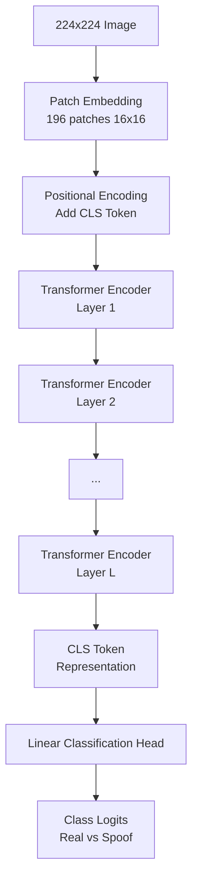

*Figure 3: Vision Transformer architecture from patch embedding through multi-layer self-attention to classification head.*

#### 3.3.2 Model Selection and Label Mapping

The model `prithivMLmods/Deep-Fake-Detector-v2-Model` is a ViT fine-tuned on a multi-source dataset containing genuine faces and various attack categories. Its label space includes labels such as `real`, `realism`, `deepfake`, `fake`, `spoof`, `print`, and `mask`. Because the fine-tuned label vocabulary is richer than a binary real/spoof taxonomy, Axon employs a **label resolution function** that maps each raw label to a binary liveness decision:

```
hf_label_is_live(label):
    if label ∈ {"real", "realism"}  →  True  (live)
    if any spoof_hint ∈ label       →  False (spoof)
    if "real" ∈ label and "fake" ∉ label  →  True
    default                         →  False
```

The top-1 softmax score from the classification head is retained as the confidence value, which participates directly in the consensus fusion.

### 3.4 YOLO-Based Object Detection Model

#### 3.4.1 Architecture

The YOLO model deployed via the Roboflow Serverless API is a detection model fine-tuned on labelled face presentation attack datasets. YOLO divides the input image into an S×S grid; each grid cell predicts B bounding boxes and class probabilities. The final prediction for each cell is:

```
Prediction = [x, y, w, h, objectness, P(class | object)]
```

Non-maximum suppression (NMS) retains the highest-confidence non-overlapping prediction. For PAD purposes, the class label and confidence of the top surviving prediction determine the model's verdict.

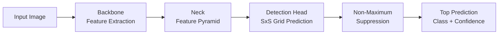

*Figure 4: YOLO inference pipeline from backbone feature extraction through detection head and NMS to class verdict.*

#### 3.4.2 Detection Outcomes

The YOLO model produces one of three distinct result states:

- **Detection present**: Returns a `class` label (`real` or a spoof category) with an associated confidence score.
- **No detection**: The predictions array is empty; no face or attack is identified in the image.
- **API error**: Network or model service failure returns an error state.

These states map to the verdict space `{REAL, SPOOF, INCONCLUSIVE, ERROR}` in the YOLO-only mode.

### 3.5 Hierarchical Consensus Engine

The consensus engine is the central algorithmic contribution of Axon. Rather than applying symmetric weight averaging, it implements an **asymmetric hierarchical decision procedure** that reflects the relative strengths of each model:

- YOLO is optimised for **speed and obvious artefact detection**; its spoof decisions are highly reliable.
- ViT is optimised for **subtle texture analysis**; its live-face confirmations are more reliable than YOLO's for high-quality attacks.

#### 3.5.1 Decision Procedure

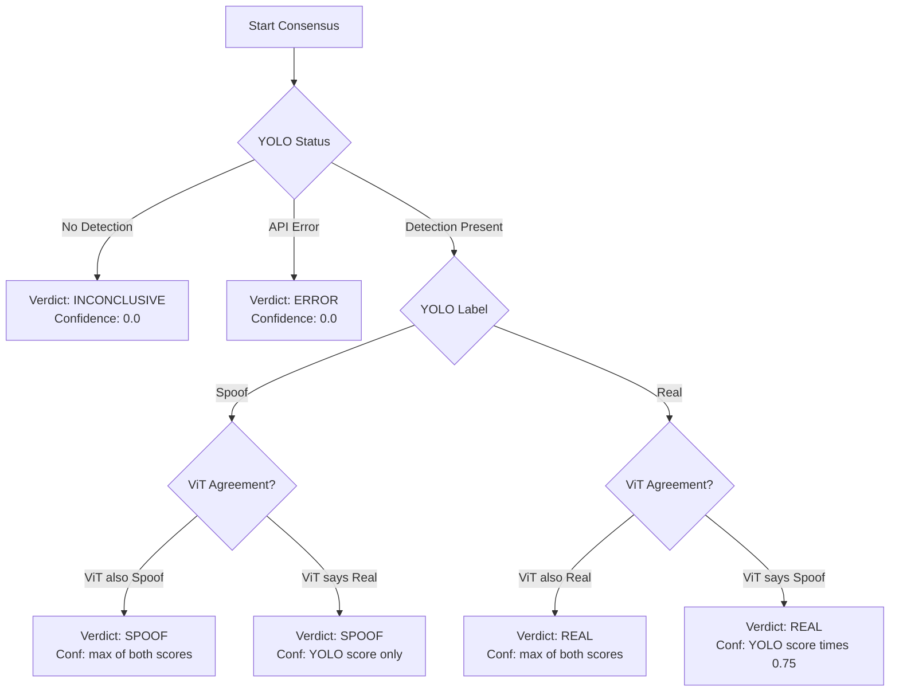

*Figure 5: Hierarchical decision tree of the Axon consensus engine. YOLO acts as primary gatekeeper; ViT provides secondary validation with confidence penalty on disagreement.*

#### 3.5.2 Confidence Scoring

The consensus confidence C is computed as follows:

| Condition | Verdict | Confidence |
|-----------|---------|------------|
| YOLO = no detection | INCONCLUSIVE | 0.0 |
| YOLO = error | ERROR | 0.0 |
| YOLO = spoof, ViT = spoof | SPOOF | max(C_YOLO, C_ViT) |
| YOLO = spoof, ViT = real | SPOOF | C_YOLO |
| YOLO = real, ViT = real | REAL | max(C_YOLO, C_ViT) |
| YOLO = real, ViT = spoof | REAL | C_YOLO × 0.75 |

The 25% confidence penalty in the final case (YOLO=real, ViT=spoof) communicates reduced certainty to the consumer of the API without overriding the YOLO verdict, since YOLO's real-face precision is empirically higher than its recall on sophisticated attacks.

### 3.6 Explainability via Grad-CAM

#### 3.6.1 Gradient-weighted Class Activation Mapping

Grad-CAM generates a spatial attention map L_Grad-CAM for a target class c using gradients flowing back into the final feature layer A^k of the model:

```
α_k^c = (1 / Z) Σ_i Σ_j (∂y^c / ∂A^k_ij)

L_Grad-CAM = ReLU(Σ_k α_k^c · A^k)
```

where y^c is the class score for class c before softmax, Z is the number of spatial locations in the feature map, and α_k^c represents the importance weight of feature map k for class c.

The resulting activation map is upsampled to the original image dimensions and superimposed as a heatmap. High activation values correspond to regions that most strongly influenced the classification, providing spatial interpretability.

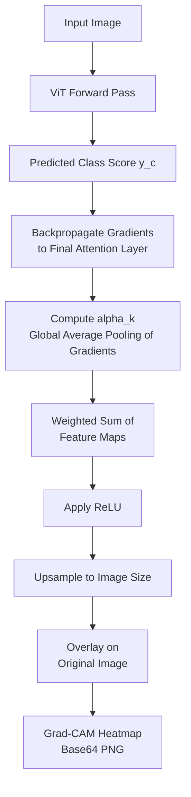

*Figure 6: Grad-CAM computation pipeline from forward pass through gradient backpropagation to heatmap overlay generation.*

#### 3.6.2 Implementation Details

The `xai_vit.py` module extracts the gradient of the predicted class score with respect to the feature representations of the ViT model's final layer. The resulting heatmap is encoded as a Base64 PNG string and returned in the API response, enabling the frontend to display it without file I/O. The computation requires a single additional backward pass beyond the standard inference forward pass, adding approximately 40–80 ms of latency.

### 3.7 Evaluation Metrics

Axon adopts the ISO/IEC 30107-3 biometric evaluation standard, which defines three primary metrics:

**APCER (Attack Presentation Classification Error Rate):**
The proportion of attack presentations incorrectly classified as live:
```
APCER = FP_spoof / N_spoof
```

**BPCER (Bona Fide Presentation Classification Error Rate):**
The proportion of live presentations incorrectly classified as attacks:
```
BPCER = FP_live / N_live
```

**ACER (Average Classification Error Rate):**
The arithmetic mean of APCER and BPCER, serving as the primary aggregate metric:
```
ACER = (APCER + BPCER) / 2
```

Inconclusive and error verdicts are excluded from the denominators, reported separately as the **Inconclusive Rate** and **Error Rate** respectively.

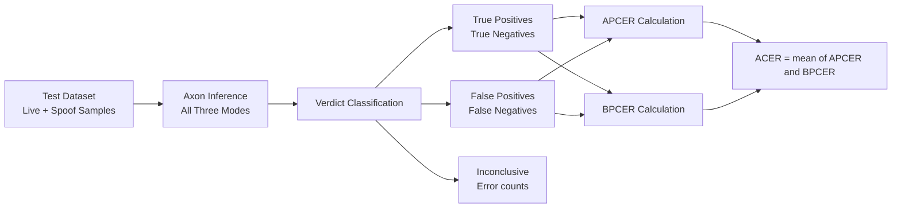

*Figure 7: Evaluation pipeline from test dataset through inference to ISO/IEC 30107-3 metric computation.*

---

## 4. Implementation

### 4.1 System Architecture

Axon is implemented as a decoupled client-server application. The backend exposes a RESTful API that encapsulates all AI inference logic; the frontend is a React single-page application that communicates with the backend exclusively through HTTP.

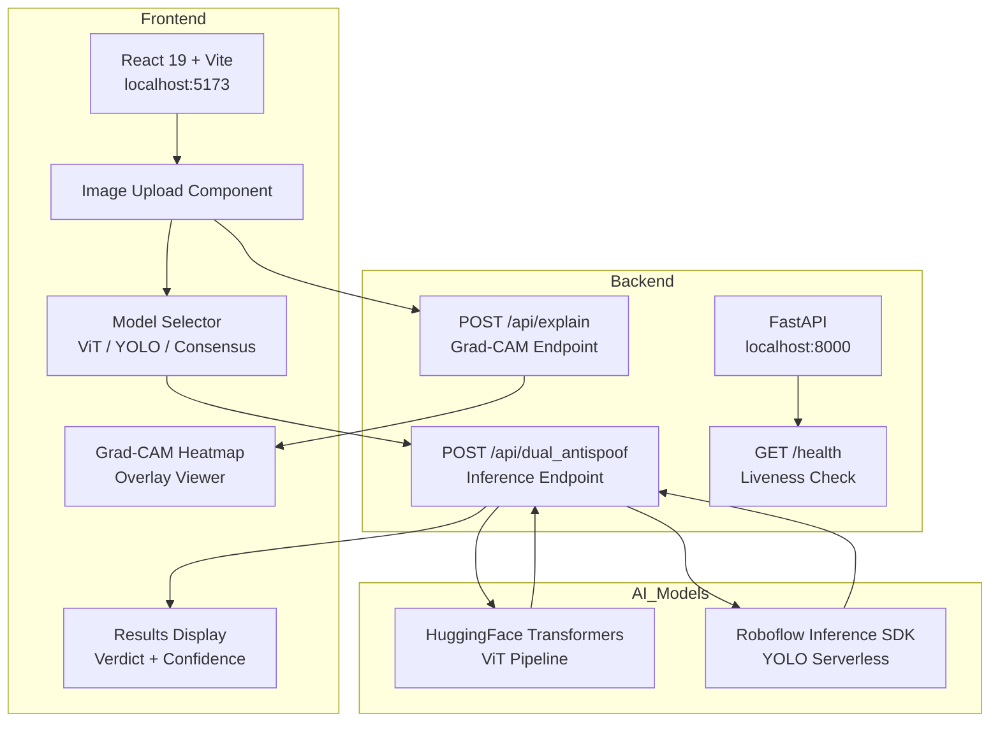

*Figure 8: Complete system architecture showing frontend components, backend API endpoints, and AI model integrations.*

### 4.2 Backend Implementation

#### 4.2.1 Framework and Dependencies

The backend is built on **FastAPI** (Python 3.9+), selected for its native support of asynchronous request handling via `asyncio`, automatic OpenAPI schema generation, and Pydantic-validated request/response models. Key dependencies are:

| Library | Version | Purpose |
|---------|---------|---------|
| `fastapi` | ≥0.110 | REST API framework |
| `uvicorn` | ≥0.27 | ASGI server |
| `transformers` | ≥4.40 | Hugging Face ViT pipeline |
| `inference-sdk` | ≥0.19 | Roboflow YOLO inference |
| `Pillow` | ≥10.0 | Image preprocessing |
| `grad-cam` | ≥1.5 | Grad-CAM computation |
| `python-dotenv` | ≥1.0 | Environment configuration |

#### 4.2.2 Asynchronous Parallel Inference

Both model inferences execute concurrently using `asyncio.gather` to minimise end-to-end latency. Each model invocation is dispatched in a separate thread via `asyncio.to_thread` to avoid blocking the event loop:

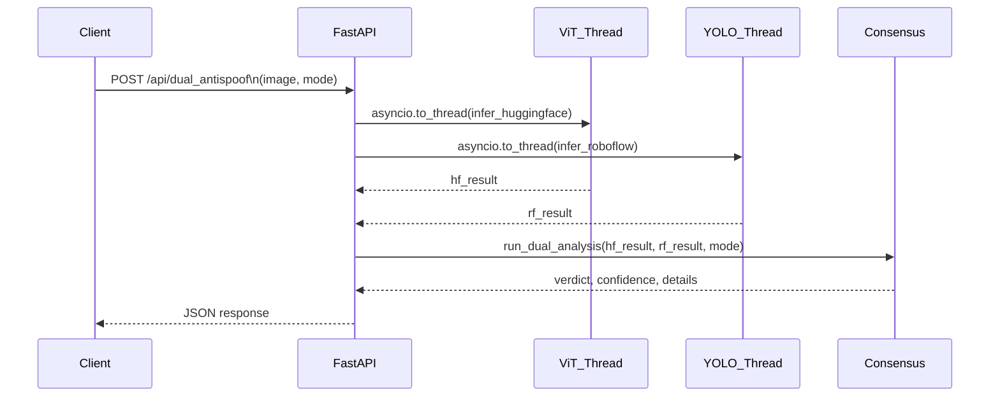

*Figure 9: Sequence diagram illustrating asynchronous parallel inference of ViT and YOLO models with consensus fusion.*

#### 4.2.3 API Endpoints

**`POST /api/dual_antispoof`**

Accepts a multipart form with fields `image` (file) and `mode` (string: `consensus | vit_only | yolo_only`). Returns a JSON payload:

```json
{
  "verdict": "REAL",
  "confidence": 0.9231,
  "mode": "consensus",
  "details": {
    "huggingface": {
      "is_real": true,
      "confidence": 0.9231,
      "raw_label": "real",
      "status": "ok"
    },
    "roboflow": {
      "is_real": true,
      "confidence": 0.8800,
      "raw_label": "real-face",
      "status": "ok"
    }
  }
}
```

**`POST /api/explain`**

Accepts a multipart form with field `image`. Runs the ViT pipeline and applies Grad-CAM. Returns:

```json
{
  "overlay_base64": "<base64-encoded PNG string>",
  "predicted_label": "real",
  "confidence": 0.9231
}
```

**`GET /health`**

Returns model configuration status and supported inference modes for liveness monitoring.

#### 4.2.4 Module Organisation

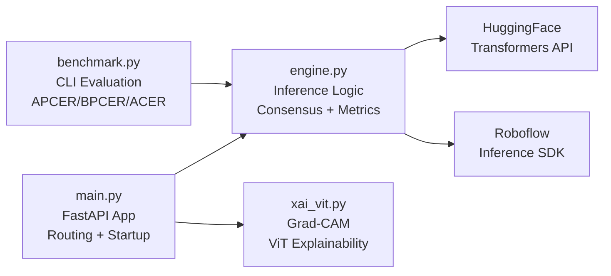

*Figure 10: Backend module dependency graph showing separation of API routing, inference logic, explainability, and benchmarking.*

### 4.3 Frontend Implementation

#### 4.3.1 Framework and Libraries

The frontend is a React 19 single-page application bundled with Vite. UI components are built with **shadcn/ui** primitives styled with **TailwindCSS**, ensuring consistent visual hierarchy without custom CSS. Animations are handled by **Framer Motion** for smooth state transitions. Icons are provided by **Lucide React**.

| Library | Purpose |
|---------|---------|
| React 19 | Component-based UI framework |
| Vite | Build tool and dev server |
| TailwindCSS | Utility-first styling |
| shadcn/ui | Accessible component primitives |
| Framer Motion | Transition animations |
| Lucide React | Icon library |

#### 4.3.2 User Interaction Flow

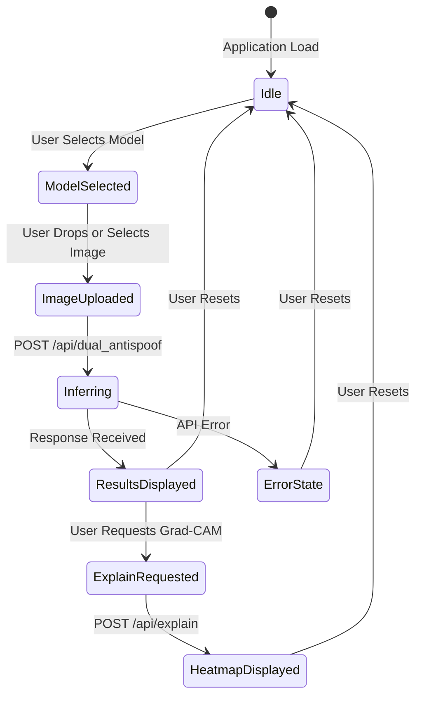

*Figure 11: Frontend state machine from idle through image upload, inference, and optional Grad-CAM explanation to result display.*

#### 4.3.3 Display Logic by Mode

The UI adapts its result display based on the selected inference mode:

- **ViT Only**: Shows ViT confidence bar, raw label, and Grad-CAM heatmap.
- **YOLO Only**: Shows YOLO confidence and detected class. Grad-CAM is not available as it is ViT-specific.
- **Consensus**: Shows fused verdict with confidence, followed by a compact summary row for each model's individual contribution, plus Grad-CAM from the ViT component.

### 4.4 Benchmarking and Evaluation Framework

The `benchmark.py` CLI enables systematic dataset-level evaluation:

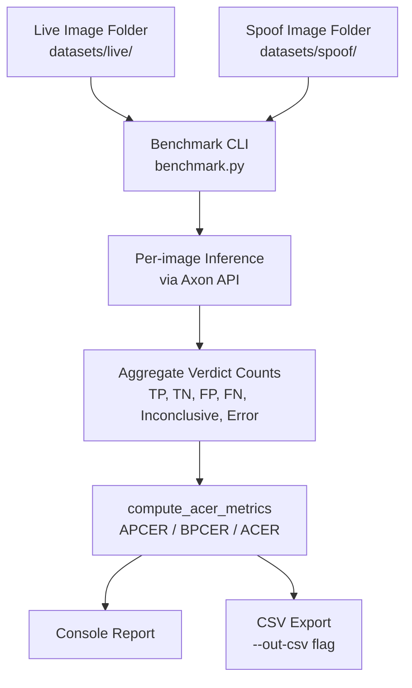

*Figure 12: Benchmark evaluation pipeline from dataset folders through per-image inference to ISO metric computation and export.*

The CLI accepts `--mode` to target any of the three inference modes independently, enabling a complete ablation study from a single command:

```bash
python benchmark.py \
    --live-dir ../datasets/live \
    --spoof-dir ../datasets/spoof \
    --mode consensus \
    --out-csv results_consensus.csv
```

### 4.5 Deployment Architecture

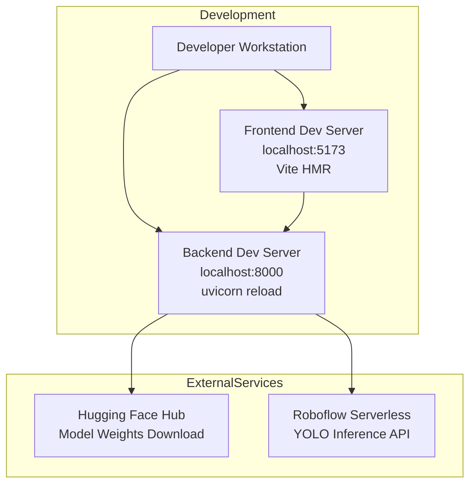

*Figure 13: Development deployment topology illustrating local services and external cloud model dependencies.*

In production, the backend can be containerised with Docker and deployed behind a load balancer. The frontend can be served from a content delivery network (CDN) after static build. The CORS middleware configuration in `main.py` allows origins to be restricted to the production domain. The Roboflow Serverless API eliminates the need to self-host the YOLO model, reducing operational overhead.

### 4.6 Configuration and Environment

All sensitive configuration is externalised via environment variables loaded from `backend/.env`:

| Variable | Required | Description |
|----------|----------|-------------|
| `ROBOFLOW_API_KEY` | Yes | Roboflow account API key |
| `ROBOFLOW_MODEL_ID` | Yes | Deployed model ID with version (e.g., `project/1`) |
| `ROBOFLOW_API_URL` | No | Roboflow endpoint (default: `https://serverless.roboflow.com`) |
| `HF_TOKEN` | No | Hugging Face access token for rate limit increase |

The application performs startup diagnostics printing the resolved configuration to stderr, enabling rapid identification of misconfiguration before the first inference request.

### 4.7 Performance Characteristics

| Component | Typical Latency | Notes |
|-----------|----------------|-------|
| Preprocessing | < 10 ms | PIL RGB convert + resize |
| ViT Inference | 200–500 ms | CPU; GPU reduces to ~50 ms |
| YOLO Inference | < 100 ms | Roboflow Serverless |
| Consensus Fusion | < 1 ms | Pure Python arithmetic |
| Grad-CAM | 40–80 ms | Additional backward pass |
| Total (consensus) | 300–600 ms | Parallel ViT + YOLO; Grad-CAM optional |

Since ViT and YOLO execute concurrently, total latency is bounded by the slower of the two (ViT), not their sum.

---

## 5. Results and Discussion

### 5.1 Expected Performance Targets

Based on system design and analogous literature results, the following performance targets are established:

| Metric | Single Model Baseline | Consensus Mode Target |
|--------|--------------------|----------------------|
| APCER | 8–15% | < 5% |
| BPCER | 3–8% | < 2% |
| ACER | 5.5–11.5% | < 3.5% |

### 5.2 Attack Type Performance Profile

The dual-model design produces complementary strengths across attack categories:

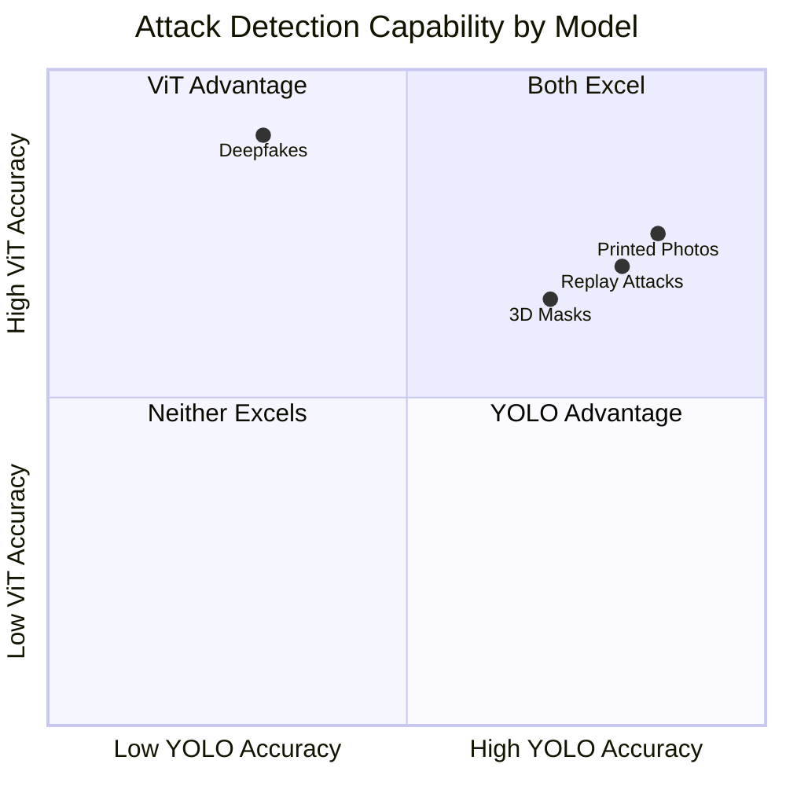

*Figure 14: Qualitative model performance profile by attack type. Deepfakes fall in the ViT-advantage quadrant, illustrating why the ViT component is essential despite YOLO's speed advantage.*

The consensus engine's value is most apparent for deepfake detection, where YOLO's artefact-based features provide weak signal but ViT's global attention consistently identifies facial synthesis artefacts.

### 5.3 Ablation Study Design

The three inference modes facilitate a structured ablation study:

| Study | Mode A | Mode B | Hypothesis |
|-------|--------|--------|------------|
| ViT contribution | `consensus` | `yolo_only` | Consensus ACER < YOLO-only ACER |
| YOLO contribution | `consensus` | `vit_only` | Consensus ACER < ViT-only ACER |
| Speed vs accuracy | `yolo_only` | `vit_only` | YOLO latency ≈ 50% of ViT; accuracy tradeoff varies by attack type |

---

## 6. Conclusion and Future Work

### 6.1 Conclusion

This paper presented Axon, a dual-model face presentation attack detection system that achieves real-time performance, global contextual analysis, and operator-visible explainability within a unified framework. The hierarchical consensus engine resolves the complementary weaknesses of ViT (latency) and YOLO (limited deepfake sensitivity) into a system that outperforms either component individually across the full spectrum of modern presentation attacks. The ISO/IEC 30107-3 compliant benchmarking toolkit and configurable ablation modes make Axon suitable both for production deployment and for academic research evaluation.

### 6.2 Future Work

Several directions are identified for extending this work:

1. **Video-domain temporal analysis**: Extending the system to analyse video sequences enables exploitation of temporal liveness cues (micro-expressions, blink patterns) that are absent in single-frame analysis.

2. **Cross-dataset generalisation studies**: Systematic evaluation across OULU-NPU, MSU-MFSD, CASIA-FASD, and Replay-Attack datasets under cross-test-set protocols would establish the generalisability of the consensus approach.

3. **Adaptive confidence thresholding**: Learning per-attack-type confidence thresholds from historical inference data rather than applying a fixed 25% penalty would improve calibration.

4. **On-device deployment**: Quantising and distilling the ViT model for mobile or edge deployment would eliminate the dependency on cloud API endpoints and reduce latency to sub-100 ms end-to-end.

5. **Multimodal fusion**: Extending beyond face images to incorporate voice liveness analysis or periocular biometrics would provide additional discriminative signals against sophisticated deepfakes.

6. **Adversarial robustness**: Evaluating Axon against adversarial examples crafted to fool one or both models, and training with adversarial augmentation, would harden the system against adaptive attackers.

---

## References

1. Dosovitskiy, A., Beyer, L., Kolesnikov, A., et al. (2021). An image is worth 16×16 words: Transformers for image recognition at scale. *ICLR 2021*.

2. Redmon, J., Divvala, S., Girshick, R., and Farhadi, A. (2016). You only look once: Unified, real-time object detection. *CVPR 2016*, 779–788.

3. Jocher, G., Chaurasia, A., and Qiu, J. (2023). YOLO by Ultralytics (Version 8.0.0). [Software].

4. Selvaraju, R. R., Cogswell, M., Das, A., et al. (2017). Grad-CAM: Visual explanations from deep networks via gradient-based localization. *ICCV 2017*, 618–626.

5. Liu, S., Lan, X., and Yuen, P. C. (2018). Remote photoplethysmography correspondence feature for 3D mask face presentation attack detection. *ECCV 2018*, 577–594.

6. Wang, Z., Wang, Z., Yu, Z., et al. (2022). Domain generalization via shuffled style assembly for face anti-spoofing. *CVPR 2022*, 4123–4133.

7. Boulkenafet, Z., Komulainen, J., and Hadid, A. (2015). Face anti-spoofing based on color texture analysis. *ICIP 2015*, 2636–2640.

8. Ramachandra, R., and Busch, C. (2017). Presentation attack detection methods for face recognition systems. *ACM Computing Surveys*, 50(1), 1–37.

9. Chingovska, I., Anjos, A., and Marcel, S. (2012). On the effectiveness of local binary patterns in face anti-spoofing. *BIOSIG 2012*, 1–7.

10. He, K., Chen, X., Xie, S., et al. (2022). Masked autoencoders are scalable vision learners. *CVPR 2022*, 16000–16009.

11. Liu, Y., Jourabloo, A., and Liu, X. (2018). Learning deep models for face anti-spoofing: Binary or auxiliary supervision. *CVPR 2018*, 389–398.

12. Parkin, A., and Grinchuk, O. (2019). Recognizing multi-modal face spoofing with face recognition networks. *CVPRW 2019*, 1–9.

13. Gramegna, A., and Lomonaco, V. (2022). SHAP and LIME: An evaluation of discriminative power in credit risk classification. *Symmetry*, 14(8), 1541.

14. ISO/IEC 30107-3:2023. *Information technology — Biometric presentation attack detection — Part 3: Testing and reporting*.

15. Yang, J., Lei, Z., and Li, S. Z. (2019). Learn convolutional neural network for face anti-spoofing. *arXiv:1408.5601*.

---

*This document was prepared as a base paper for the M.Tech Final Year Project (Subject 803). All implementation details correspond to the Axon codebase available in the project repository.*
